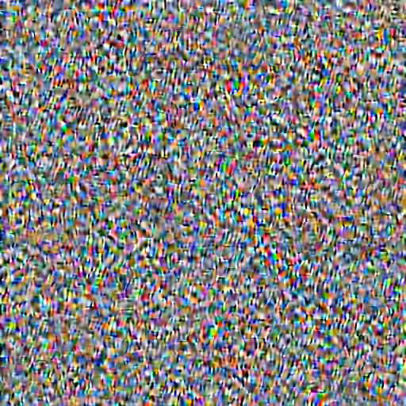
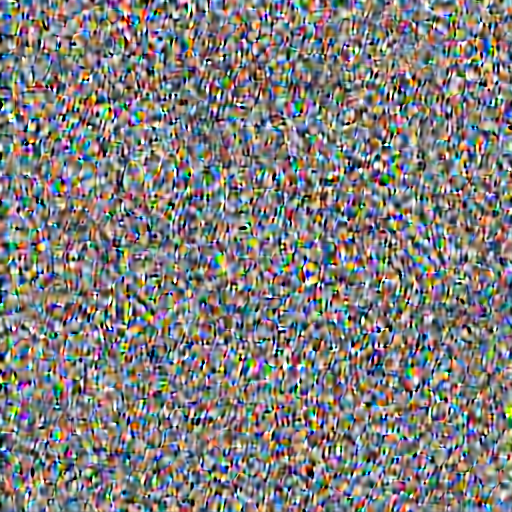
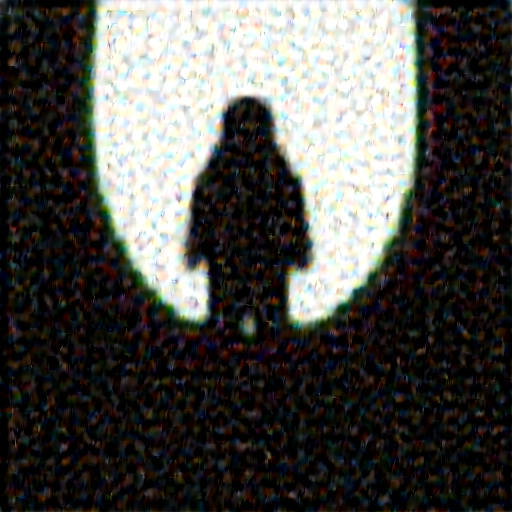

# repo title

You may find this repo interesting for the following reasons:
- You want to debug samplers implemented in `diffusers` against those in `k-diffusion` or other frameworks. This can be very useful if you want to back-port certain samplers in other frameworks back into diffusers.
- You prefer a more functional-style implementation of samplers rather than the more stateful (and IMO much more complicated) design of schedulers in `diffusers`.

## Files

See:
- `sdxl_comfy_pipeline.py`: SDXL text-to-image pipeline that delegates to k-diffusion samplers.
- `flux_comfy_pipeline.py`: same but for FLUX.

## Samples

To generate samples, run either `python test.py` or `python test_flux.py`. In order for the pipelines to function correctly some hacks must be done.

Note that FLUX has a different theoretical parameterisation to denoising diffusion so this may explain the bad outputs for some of the schedulers below.

<table>
<tr>
    <th>Samples</th>
</tr>

<tr>
<td>sdxl - sample_dpm_2 </td><td>flux - sample_dpm_2 </td>
</tr>
<tr>
<td>sdxl - sample_dpm_2_ancestral </td><td>flux - sample_dpm_2_ancestral </td>
</tr>
<tr>
<td>sdxl - sample_dpmpp_2m </td><td>flux - sample_dpmpp_2m </td>
</tr>
<tr>
<td>sdxl - sample_dpmpp_2m_sde </td><td>flux - sample_dpmpp_2m_sde </td>
</tr>
<tr>
<td>sdxl - sample_dpmpp_2s_ancestral </td><td>flux - sample_dpmpp_2s_ancestral </td>
</tr>
<tr>
<td>sdxl - sample_dpmpp_3m_sde </td><td>flux - sample_dpmpp_3m_sde </td>
</tr>
<tr>
<td>sdxl - sample_dpmpp_sde </td><td>flux - sample_dpmpp_sde </td>
</tr>
<tr>
<td>sdxl - sample_euler </td><td>flux - sample_euler </td>
</tr>
<tr>
<td>sdxl - sample_euler_ancestral </td><td>flux - sample_euler_ancestral </td>
</tr>
<tr>
<td>sdxl - sample_heun </td><td>flux - sample_heun </td>
</tr>
<tr>
<td>sdxl - sample_lms </td><td>flux - sample_lms </td>
</tr>

</table>